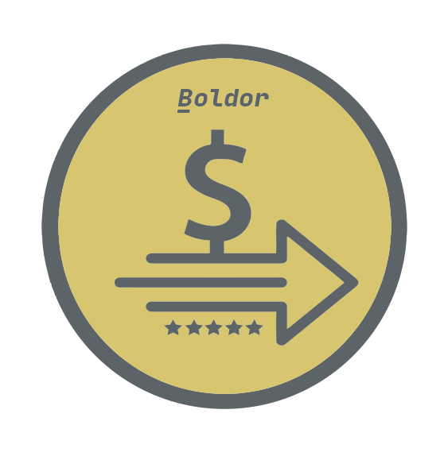

# boldor

<h2>
  Work with the
  <span style="color: #e6d073">Bs bolivar</span> and the
  <span style="color: #6fca49">💲 dollar</span> as
  currencies in your projects.
</h2>



### For this library to work, you need to work with `Javascript modules`.

#### Note: the bolivar is the currency of Venezuela. 🇻🇪

<hr>

## Development

Requirements:

- NodeJS

<hr>

Development process:

```
npm i boldor
```

or

```
yarn add boldor
```
